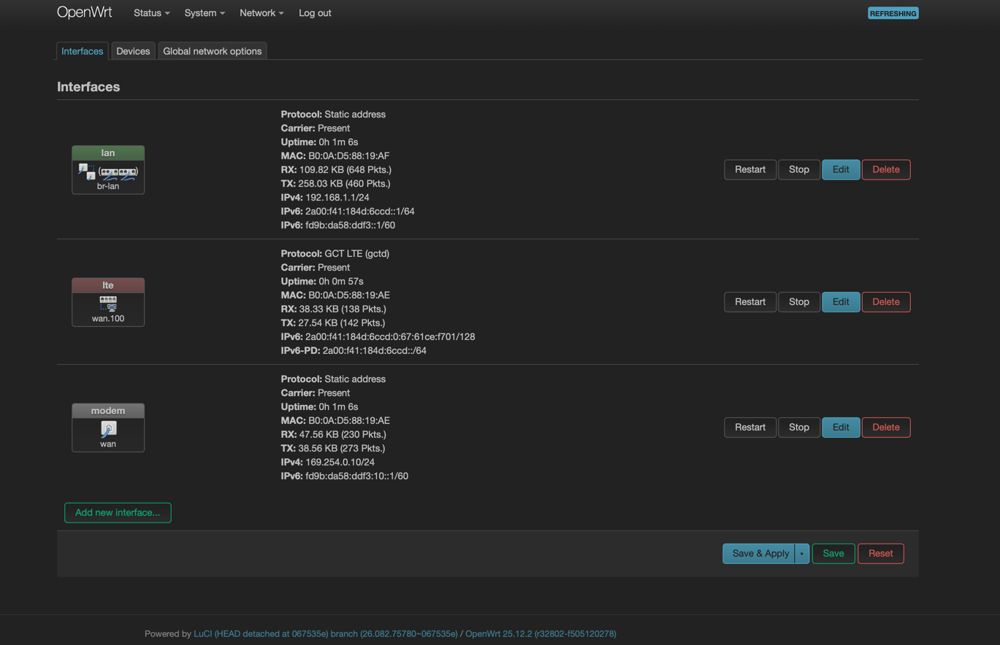
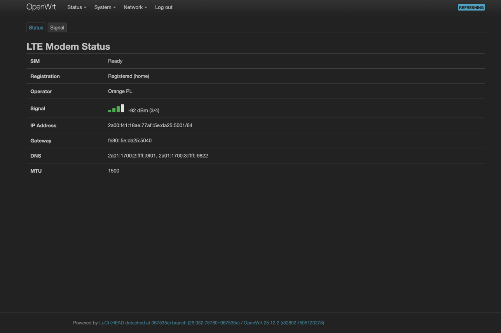
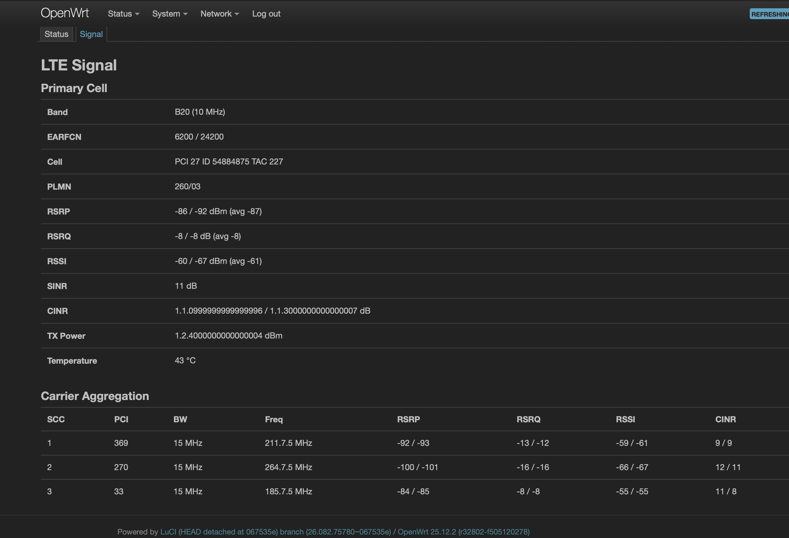
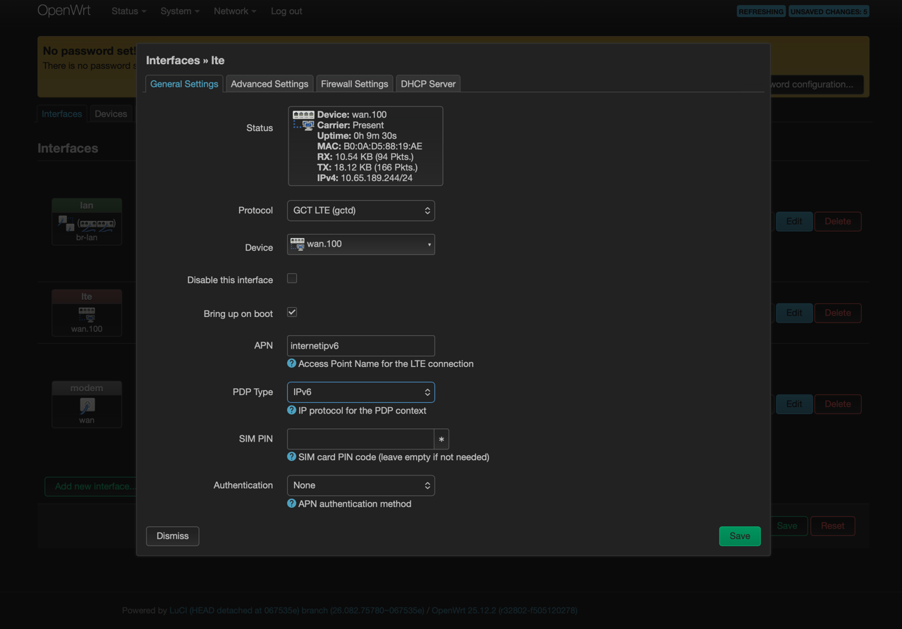
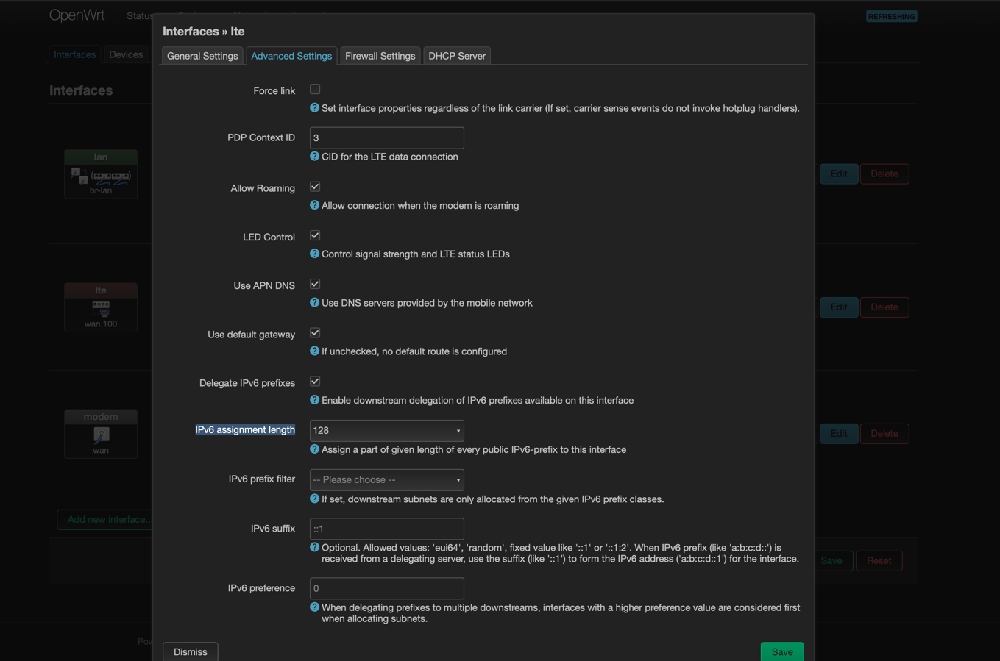
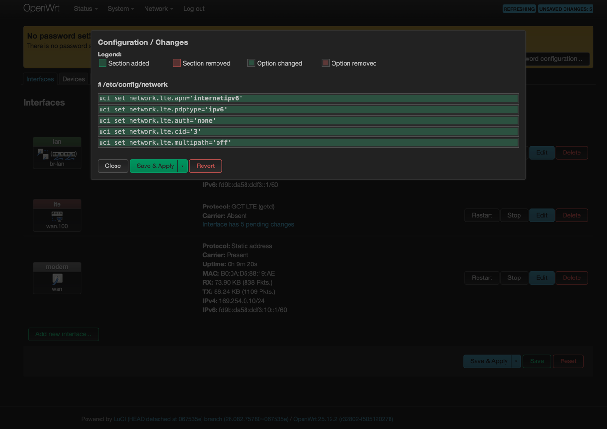

# gctd — GCT GDM7243 LTE modem daemon for OpenWrt

Lightweight LTE modem daemon for routers with the GCT GDM7243 modem connected via internal Ethernet (not USB). Written in Zig, cross-compiles to a single static binary (~130KB) with zero runtime dependencies.

Designed for the **ZTE MF258** (MF258 / MK258) LTE CPE running OpenWrt, but should work with any router using the GDM7243 modem with the same Ethernet-based AT command interface.

## Screenshots

### LuCI — Interface List


### LuCI — LTE Status


### LuCI — Signal & Carrier Aggregation


### LuCI — Interface Configuration




## How it works

The GDM7243 modem communicates over an internal Ethernet link (not USB):

```
┌──────────────┐   Ethernet (eth1/wan)   ┌──────────────┐
│    Router     │◄───────────────────────►│  GDM7243     │
│ 169.254.0.10  │  AT cmds: TCP :7788     │ 169.254.0.1  │
│               │  Keepalive: UDP :4667   │              │
│               │  LTE data: VLAN 100     │              │
└──────────────┘                          └──────────────┘
```

- **AT commands** are sent over TCP to port 7788 (not serial)
- **UDP keepalive** ("IDU ALIVE" / "ODU ALIVE") on port 4667 is required — without it the modem considers the router dead
- **LTE data** flows through a VLAN on the same Ethernet interface (default: VLAN 100)
- **IP address** is assigned based on `AT+CGCONTRDP` response and pushed to netifd via `ubus notify_proto`

## Features

- **netifd protocol handler** (`proto 'gctd'`) — `ifup lte` / `ifdown lte` manage daemon lifecycle
- **Full LTE connection sequence** — SIM PIN → PDP config → registration → activation → IP/route via ubus
- **IPv4 and IPv6** support (including GDM7243 byte-decimal IPv6 format auto-conversion)
- **IPv6 prefix delegation** to LAN via `ip6prefix` in notify_proto
- **UDP keepalive** thread — keeps modem alive
- **Signal monitoring** with LED control (RSRP → 4 signal bars via sysfs)
- **Detailed signal info** with carrier aggregation (`AT%GLTECONNSTATUS`, `AT%GDMITEM?`)
- **Cell locking** (primary + secondary) and frequency range restrictions
- **Auto-reconnect** when registration is lost
- **Graceful shutdown** on SIGTERM/SIGINT (disconnect LTE, stop threads)
- **CLI tools** for manual AT commands and status queries
- **LuCI web interface** — status, signal monitoring, configuration via interface edit
- **Single static binary** (~130KB), no dependencies

## Quick start

### 1. Build

Requires [Zig](https://ziglang.org/) 0.15.2

```sh
zig build -Dtarget=mipsel-linux-musl --release=small
```

### 2. Install on router

```sh
ROUTER=root@192.168.1.1

# Create directories
ssh $ROUTER "mkdir -p /usr/libexec/rpcd /usr/share/luci/menu.d /usr/share/rpcd/acl.d /www/luci-static/resources/protocol /www/luci-static/resources/view/gctd"

# Daemon binary
scp -O zig-out/bin/gctd $ROUTER:/usr/sbin/gctd

# netifd protocol handler + config
scp -O files/lib/netifd/proto/gctd.sh $ROUTER:/lib/netifd/proto/gctd.sh
scp -O files/etc/config/gctd $ROUTER:/etc/config/gctd

# LuCI integration (optional)
scp -O files/www/luci-static/resources/protocol/gctd.js $ROUTER:/www/luci-static/resources/protocol/gctd.js
scp -O files/usr/libexec/rpcd/gctd $ROUTER:/usr/libexec/rpcd/gctd
scp -O files/usr/share/luci/menu.d/luci-app-gctd.json $ROUTER:/usr/share/luci/menu.d/luci-app-gctd.json
scp -O files/usr/share/rpcd/acl.d/luci-app-gctd.json $ROUTER:/usr/share/rpcd/acl.d/luci-app-gctd.json
scp -O files/www/luci-static/resources/view/gctd/*.js $ROUTER:/www/luci-static/resources/view/gctd/

# Set permissions
ssh $ROUTER "chmod +x /usr/sbin/gctd /lib/netifd/proto/gctd.sh /usr/libexec/rpcd/gctd"
```

### 3. Configure

```sh
# Static IP for modem communication
uci set network.modem=interface
uci set network.modem.device='wan'
uci set network.modem.proto='static'
uci set network.modem.ipaddr='169.254.0.10'
uci set network.modem.netmask='255.255.255.0'

# LTE interface with gctd proto handler
uci set network.lte=interface
uci set network.lte.device='wan.100'
uci set network.lte.proto='gctd'
uci set network.lte.apn='internet'

# Add lte to wan firewall zone (masquerade + forwarding)
uci add_list firewall.@zone[1].network='lte'

uci commit
/etc/init.d/network restart
```

### 4. Test

```sh
gctd at "AT"              # should print "OK"
gctd status               # show SIM/signal/registration
ifup lte                  # start gctd daemon via netifd
```

## CLI commands

```
gctd                              show help
gctd daemon <iface> <dev> [opts]  run daemon (started by netifd)
gctd at "AT+CMD"                  send raw AT command
gctd status                       connection status (human-readable)
gctd status-json                  connection status (JSON)
gctd signal                       detailed signal (human-readable)
gctd signal-json                  detailed signal (JSON)
gctd bands                        show supported LTE bands
gctd lockcell E P [E P ...]       lock primary cell(s)
gctd lockscell E P [E P ...]      lock secondary cell(s)
gctd freqrange [B S E ...]        set/show frequency ranges
gctd freqrange clear              clear all frequency ranges
gctd unlock                       remove all cell locks
gctd sms                          list all SMS messages
gctd sms delete <idx>             delete SMS by index
gctd sms delete all               delete all SMS messages
```

### Example output

```
$ gctd status
SIM: Ready
Registration: Registered (home)
Operator: Orange PL
Signal: -96 dBm (2/4 bars)
IP: 2a00:f41:18d7:ba80::37:3f57:cc01/64
GW: fe80::37:3f57:cc40
DNS1: 2a01:1700:2:ffff::9f01
DNS2: 2a01:1700:3:ffff::9822

$ gctd signal
Band 7 (15 MHz)  EARFCN 3025/21025
Cell  PCI 270  ID 54884895  TAC 227
PLMN  260/03
RSRP  -96 / -92 dBm  (avg -94)
RSRQ  -10 / -8 dB   (avg -8)
RSSI  -65 / -63 dBm  (avg -66)
SINR  18 dB
CINR  15.2 / 18.1 dB
TX    12.5 dBm
Temp  42 C

Carrier Aggregation:
  SCC1  PCI 270  15 MHz  2647.5 MHz
    RSRP -76 / -140  RSRQ -15 / -102  RSSI -42 / -88  CINR 3 / -17
  SCC2  PCI 33  15 MHz  1857.5 MHz
    RSRP -113 / -123  RSRQ -158 / -154  RSSI -74 / -79  CINR -17 / -17
```

## Configuration

Configuration is split between two locations:

### Connection options (`/etc/config/network`, interface section)

Set via LuCI interface edit or UCI. Passed to gctd by the proto handler as CLI arguments.

| Option | Default | Description |
|--------|---------|-------------|
| `apn` | `internet` | APN for the LTE connection |
| `pdptype` | `ip` | PDP type: `ip`, `ipv6`, `ipv4v6` |
| `auth` | `none` | APN authentication: `none`, `pap`, `chap` |
| `username` | *(empty)* | APN auth username (for PAP/CHAP) |
| `password` | *(empty)* | APN auth password (for PAP/CHAP) |
| `pin` | *(empty)* | SIM PIN code (leave empty if not needed) |
| `cid` | `3` | PDP context ID (CID 3 maps to VLAN 100 on GDM7243) |
| `allow_roaming` | `1` | Allow connection when roaming |
| `leds` | `1` | Enable signal/LTE/net LED control (0 to disable) |
| `use_apn_dns` | `1` | Use DNS servers from the mobile network |

### Modem options (`/etc/config/gctd`)

Static modem communication settings, rarely changed:

| Option | Default | Description |
|--------|---------|-------------|
| `mode` | `netifd` | Network config mode: `netifd` (via ubus notify_proto) or `ip` (raw ip commands) |
| `modem_ip` | `169.254.0.1` | Modem management IP address |
| `at_port` | `7788` | TCP port for AT commands |
| `keepalive_port` | `4667` | UDP port for keepalive |
| `keepalive_interval` | `5` | Keepalive interval in seconds |
| `monitor_interval` | `15` | Signal/LED monitor interval in seconds |

## LuCI web interface

- **Status → LTE Modem → Status** — SIM, registration, operator, signal bars, IP, gateway, DNS, MTU
- **Status → LTE Modem → Signal** — band, EARFCN, cell info, RSRP/RSRQ/RSSI/SINR/CINR, carrier aggregation table
- **Network → Interfaces → lte → Edit** — APN, PDP type, PIN, authentication, CID, roaming, LEDs, DNS options

### Firewall

The `lte` interface must be in a firewall zone with masquerade for LAN clients to access the internet:

```
config zone
    option name 'wan'
    option masq '1'
    list network 'lte'

config forwarding
    option src 'lan'
    option dest 'wan'
```

### IPv6

The GDM7243 modem supports IPv6. To use IPv6, set the PDP type to `ipv6` or `ipv4v6`:

```sh
uci set network.lte.pdptype='ipv6'
uci set network.lte.apn='internetipv6'   # APN may differ for IPv6 (check your operator)
uci set network.lte.ip6assign='128'
uci commit network
ifdown lte && ifup lte
```

## File structure

```
├── src/                        Zig source code
├── files/                      OpenWrt overlay (copy to router root /)
│   ├── etc/config/gctd                           UCI config (modem settings)
│   ├── lib/netifd/proto/gctd.sh                  netifd protocol handler
│   ├── usr/libexec/rpcd/gctd                     rpcd plugin (ubus API for LuCI)
│   ├── usr/share/luci/menu.d/luci-app-gctd.json  LuCI menu entries
│   ├── usr/share/rpcd/acl.d/luci-app-gctd.json   LuCI ACL permissions
│   ├── www/luci-static/resources/protocol/gctd.js LuCI protocol handler
│   └── www/luci-static/resources/view/gctd/       LuCI views
│       ├── status.js                              connection status page
│       └── signal.js                              signal & CA page
├── screens/                    Screenshots
├── build.zig
├── README.md
└── LICENSE
```

## Architecture

```
src/
├── main.zig       CLI dispatch + daemon mode (keepalive → connect → monitor loop)
├── commands.zig   Typed AT command wrappers (querySignal, queryRegistration, etc.)
├── signal.zig     Detailed signal parsing (AT%GLTECONNSTATUS, AT%GDMITEM?, bands)
├── at.zig         AT command transport over TCP (connect, send, parse response)
├── keepalive.zig  UDP "IDU ALIVE" ↔ "ODU ALIVE" keepalive thread
├── connect.zig    LTE connection: SIM check → register → activate → notify_proto
├── monitor.zig    Signal strength polling + LED updates
├── led.zig        sysfs LED control (/sys/class/leds/*)
└── config.zig     UCI config parser (/etc/config/gctd)
```

### Connection sequence

1. Wait for modem alive (keepalive thread must be running)
2. `AT+CPIN?` — check SIM status, enter PIN if needed
3. `AT+CGDCONT` — configure PDP context (APN, protocol type)
4. `AT+CGAUTH` — configure APN authentication (if PAP/CHAP)
5. `AT+CFUN=1` — set full functionality
6. `AT+CGATT=1` — attach to network
7. `AT+CEREG?` — wait for registration (home or roaming)
8. `AT+CGACT=1,<cid>` — activate PDP context
9. `AT+CGCONTRDP=<cid>` — get IP, mask, gateway, DNS, MTU
10. Push IP/route/DNS to netifd via `ubus call network.interface notify_proto`

IPv6 addresses from `AT+CGCONTRDP` are returned in GDM7243 byte-decimal format (e.g. `42.0.15.65.24.215.186.128...`) and automatically converted to standard hex notation (e.g. `2a00:f41:18d7:ba80::37:3f57:cc01`).

### Signal strength mapping

`AT+CESQ` RSRP field (0-97): `dBm = value - 141`

| RSRP (dBm) | Bars | Quality |
|-------------|------|---------|
| < -120 | 0 | No signal |
| -120 to -106 | 1 | Poor |
| -105 to -96 | 2 | Fair |
| -95 to -81 | 3 | Good |
| >= -80 | 4 | Excellent |

## Modem access (telnet)

The GDM7243 modem runs Linux internally and can be accessed via telnet for debugging:

```sh
telnet 169.254.0.1
# Login: root / Si8a&2vV9
```

Execute commands on the modem remotely:

```sh
gctd at 'AT%SYSCMD="cat /etc/version.txt"'
```

## Running tests

```sh
zig build test
```

Tests cover IPv6 byte-decimal parsing, signal response parsing, carrier aggregation parsing, and CGCONTRDP field indexing.

## Hardware compatibility

Tested on:
- **ZTE MF258** (MT7621 + GDM7243) with OpenWrt 25.12.2

Should work with any router using the GCT GDM7243 modem with:
- Ethernet-based AT commands on TCP (not serial/USB)
- UDP keepalive protocol ("IDU ALIVE" / "ODU ALIVE")
- VLAN-based data path

Other known devices with GDM7243: CUDY X6

## Credits

- [lted_mf258](https://github.com/nedyarrd/lted_mf258) by nedyarrd — C implementation for CUDY X6, used as reference for the AT command sequence and keepalive protocol

## License

MIT
